<!-- Generated by scripts/build.py -->

  <h1>Sankalp Varshney</h1>
  
<strong>Software Engineer | Cloud Architect | Data Science and AI/ML Enthusiast</strong>

  
Architecting enterprise platforms, cloud infrastructure, and automated delivery systems.

  

    
    
  

  <h2>Terminal Window</h2>
  

  <h2>Neofetch</h2>
  

  <h2>Tech Stack</h2>
  

    
    
    
    
    
    
    
    
    
    
    
    
    
    
    
  

